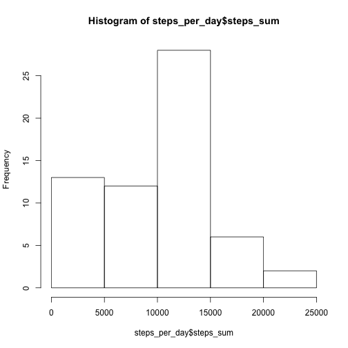
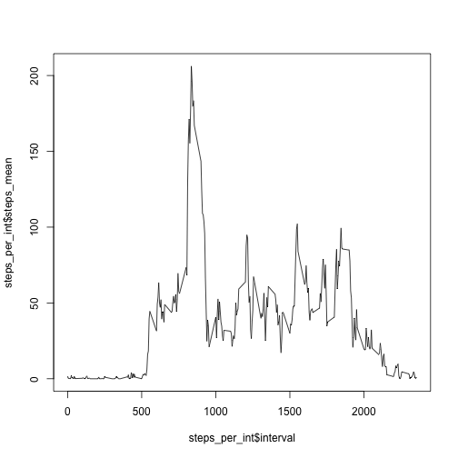
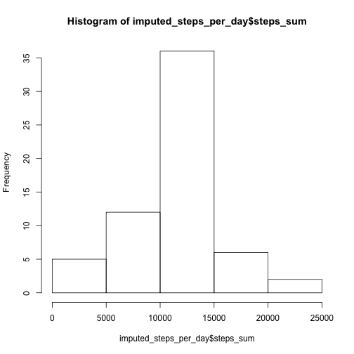
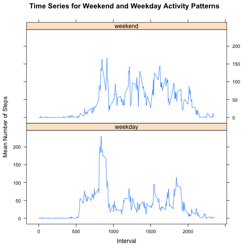

### Loading and preprocessing the data
We begin by reading in the dataset.

```r
if (!file.exists("activity.csv")) {
    url="http://d396qusza40orc.cloudfront.net/repdata%2Fdata%2Factivity.zip"
    download.file(url, "activity.zip", quiet=T)
    unzip("activity.zip")
    unlink("activity.zip")
    }
data <- read.csv("activity.csv")
```


We use the package lubridate to correctly parse the date column, since it was originally read in as a factor.

```r
data2 <- mutate(data, date=ymd(date))
```

### What is mean total number of steps taken per day?
We calculate the total number of steps on each day, plot a histogram, and report the mean and median of the total number of steps per day.

```r
steps_per_day <- summarize(group_by(data2, date), steps_sum = sum(steps, na.rm=TRUE))
hist(steps_per_day$steps_sum)
```

 

```r
mean(steps_per_day$steps_sum)
```

```
## [1] 9354.23
```

```r
median(steps_per_day$steps_sum)
```

```
## [1] 10395
```

### What is the average daily activity pattern?
We calculate the average number of steps for each interval, make a time series plot, and report the interval that contains the maximum number of steps.

```r
steps_per_int <- summarize(group_by(data2, interval), steps_mean = mean(steps, na.rm=TRUE))
plot(steps_per_int$interval, steps_per_int$steps_mean, type="l")
```

 

```r
filter(steps_per_int, steps_mean==max(steps_mean))
```

```
## Source: local data frame [1 x 2]
## 
##   interval steps_mean
## 1      835   206.1698
```

Interval 835 contains the maximum number of steps.

### Imputing missing values
Calculate the number of missing values in the datase, as follows:

```r
sum(is.na(data2$steps))
```

```
## [1] 2304
```

We will fill in missing values using the mean number of steps per day for that day. 

```r
data2_not_na <- filter(data2, !is.na(steps))
data2_na <- filter(data2, is.na(steps))
data3_na <- left_join(data2_na, steps_per_int, by="interval")
data4_na <- mutate(data3_na, steps=steps_mean)[,1:3]
data_imputed <- rbind(data2_not_na, data4_na)
```

We now create a histogram of the total number of steps taken each day and report the mean and median total number of steps taken per day.

```r
imputed_steps_per_day <- summarize(group_by(data_imputed, date), steps_sum = sum(steps))
hist(imputed_steps_per_day$steps_sum)
```

 

```r
mean(imputed_steps_per_day$steps_sum)
```

```
## [1] 10766.19
```

```r
median(imputed_steps_per_day$steps_sum)
```

```
## [1] 10766.19
```

These values from the imputed data set are slightly higher than the estimates in the first part of the assignment.And the resulting histogram has fewer 0 values.

### Are there differences in activity patterns between weekdays and weekends?
Using the dataset with imputed values, we identify weekday vs. weekend dates.

```r
data_imputed2 <- mutate(data_imputed, day = weekdays(date))
data_imputed3 <- mutate(data_imputed2, day_type = as.factor(ifelse(day %in% c("Saturday","Sunday"), "weekend", "weekday")))
data_imputed4 <- summarize(group_by(data_imputed3, interval, day_type), mean_steps=mean(steps))
library(lattice)
xyplot(mean_steps ~ interval | day_type, data_imputed4, type = "l", layout = c(1, 2), ylab = "Mean Number of Steps", xlab = "Interval", main = "Time Series for Weekend and Weekday Activity Patterns")
```

 
